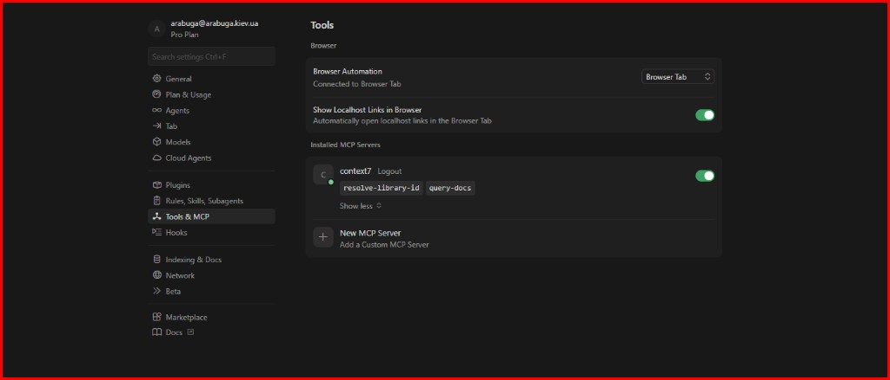

# Model Context Protocol (MCP) — this project

[Model Context Protocol](https://modelcontextprotocol.io/) lets Cursor (and other clients) call external tools (documentation lookup, browser automation, GitHub APIs, etc.). This file describes **what is committed in this repository** and how to confirm it works.

## Configuration in the repo

| File | Role |
|------|------|
| [`.cursor/mcp.json`](../../.cursor/mcp.json) | Project-level MCP server definitions for Cursor |

Current contents (summary):

- **`context7`** — remote MCP at `https://mcp.context7.com/mcp` ([Context7](https://github.com/upstash/context7)): resolve library IDs and query up-to-date docs (tools such as `resolve-library-id`, `query-docs` per Context7 documentation).

No API keys or tokens are stored in `mcp.json`. For higher Context7 rate limits, configure authentication per [Context7 client docs](https://context7.com/docs/resources/all-clients) (e.g. dashboard key, `npx ctx7 setup --cursor`, or headers for the remote server).

## Screenshot (Cursor)

**Settings → Tools & MCP:** `context7` enabled with tools `resolve-library-id` and `query-docs`; browser automation can be connected separately (built-in Cursor tooling, not from `mcp.json`).

*Stored in-repo:* [`docs/assets/mcp-cursor-context7.png`](../assets/mcp-cursor-context7.png)

## How to verify (Context7)

1. Open this repository as the workspace root in **Cursor**.
2. Open **Cursor Settings → MCP** (or the MCP panel) and confirm the **context7** server is listed and enabled.
3. In Chat / Agent, ask for documentation on a known library via Context7 (e.g. “use Context7 for Vite plugin API”) and confirm the model can retrieve structured doc excerpts, not only training cut-off knowledge.
4. If the server fails to connect, check corporate proxy/VPN and that `https://mcp.context7.com/mcp` is reachable from your machine.

## Optional MCP not in `mcp.json`

Cursor also supports additional MCP servers at the **user** or **IDE** level (not always checked into git). Examples you may enable separately:

- **Browser / IDE browser** — automation and snapshots for local frontend checks (workflow: navigate → snapshot → interact; see Cursor MCP docs for the exact server name and tools).
- **GitHub** — issues, PRs, repository context (requires a PAT or OAuth app per server instructions; do not commit secrets).

If you add more servers for this course or team, prefer environment variables or Cursor’s secret storage for tokens, and extend `.cursor/mcp.json` only with non-sensitive entries.

## Related docs

- Quick setup notes: [`dev-setup.md`](dev-setup.md) (Context7 + optional CGC).
- Tooling overview: [`../memory/techContext.md`](../memory/techContext.md).
